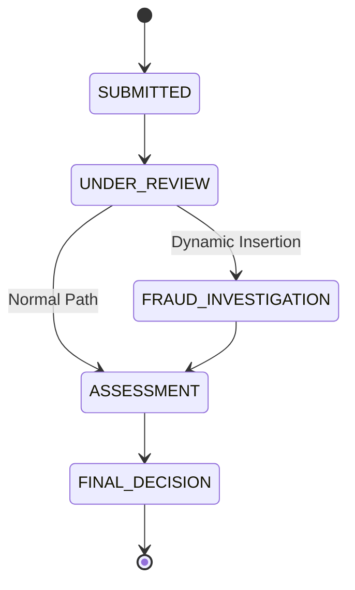

# Multi-Agent Orchestration System for Insurance Claims

A FastAPI-based MVP implementing a state machine with dynamic routing and event-driven agent orchestration.

## Architecture Overview



---

## Proposed Changes

### Core Module (`/app/core/`)

#### [NEW] [states.py](file:///c:/Users/Thimira Kodithuwakku/Documents/Development/Claim Automation/app/core/states.py)

- Define `ClaimState` enum with states: `SUBMITTED`, `UNDER_REVIEW`, `ASSESSMENT`, `FINAL_DECISION`
- Include `FRAUD_INVESTIGATION` as optional dynamic state

#### [NEW] [models.py](file:///c:/Users/Thimira Kodithuwakku/Documents/Development/Claim Automation/app/core/models.py)

- `Claim` Pydantic model with fields:
  - `id: str` (UUID)
  - `claimant_name: str`
  - `amount: float`
  - `description: str`
  - `requires_investigation: bool = False`
  - `current_state: ClaimState`
  - `state_history: List[ClaimState]`
  - `created_at: datetime`

---

### State Machine (`/app/state_machine/`)

#### [NEW] [machine.py](file:///c:/Users/Thimira Kodithuwakku/Documents/Development/Claim Automation/app/state_machine/machine.py)

- `ClaimStateMachine` class:
  - Manages valid transitions between states
  - `transition(claim, target_state)` - validates and executes state transition
  - `insert_state(claim, new_state, before_state)` - dynamically inserts a state into the workflow
  - Updates `state_history` on each transition

---

### Agents (`/app/agents/`)

#### [NEW] [evaluator.py](file:///c:/Users/Thimira Kodithuwakku/Documents/Development/Claim Automation/app/agents/evaluator.py)

- `agent_evaluation(claim)` - async function that:
  - Simulates two agents checking the claim
  - Returns decision on whether `FRAUD_INVESTIGATION` is needed
  - Uses `claim.requires_investigation` flag for routing logic

---

### Process Monitor (`/app/monitors/`)

#### [NEW] [process_monitor.py](file:///c:/Users/Thimira Kodithuwakku/Documents/Development/Claim Automation/app/monitors/process_monitor.py)

- `ProcessMonitor` class:
  - Watches claim state changes
  - Triggers `agent_evaluation()` when claim enters `UNDER_REVIEW`
  - Coordinates dynamic state insertion based on evaluation result

---

### API Layer (`/app/api/`)

#### [NEW] [endpoints.py](file:///c:/Users/Thimira Kodithuwakku/Documents/Development/Claim Automation/app/api/endpoints.py)

- `POST /claims` - Create new claim (starts in SUBMITTED)
- `GET /claims/{claim_id}` - Get claim details and current state
- `POST /claims/{claim_id}/advance` - Advance claim to next state
- `GET /claims/{claim_id}/history` - Get state transition history

---

### Application Entry

#### [NEW] [main.py](file:///c:/Users/Thimira Kodithuwakku/Documents/Development/Claim Automation/app/main.py)

- FastAPI app initialization
- Include routers
- CORS and middleware setup

#### [NEW] [requirements.txt](file:///c:/Users/Thimira Kodithuwakku/Documents/Development/Claim Automation/requirements.txt)

- `fastapi`, `uvicorn`, `pydantic`

---

## Verification Plan

### Automated Tests

#### Unit Tests

Run with: `python -m pytest app/tests/ -v`

| Test File               | Coverage                                                  |
| ----------------------- | --------------------------------------------------------- |
| `test_state_machine.py` | State transitions, invalid transitions, dynamic insertion |
| `test_agents.py`        | Agent evaluation logic, fraud detection routing           |
| `test_monitor.py`       | Event hook triggering on state change                     |

### Manual Verification

1. **Start the server:**

   ```bash
   cd "c:\Users\Thimira Kodithuwakku\Documents\Development\Claim Automation"
   uvicorn app.main:app --reload
   ```

2. **Test Normal Flow (no investigation):**

   - Create claim with `requires_investigation: false`
   - Advance through: SUBMITTED → UNDER_REVIEW → ASSESSMENT → FINAL_DECISION

3. **Test Dynamic Routing (with investigation):**

   - Create claim with `requires_investigation: true`
   - Verify at UNDER_REVIEW: system inserts FRAUD_INVESTIGATION
   - Flow becomes: SUBMITTED → UNDER_REVIEW → FRAUD_INVESTIGATION → ASSESSMENT → FINAL_DECISION

4. **Verify via Swagger UI:** Open `http://localhost:8000/docs`
