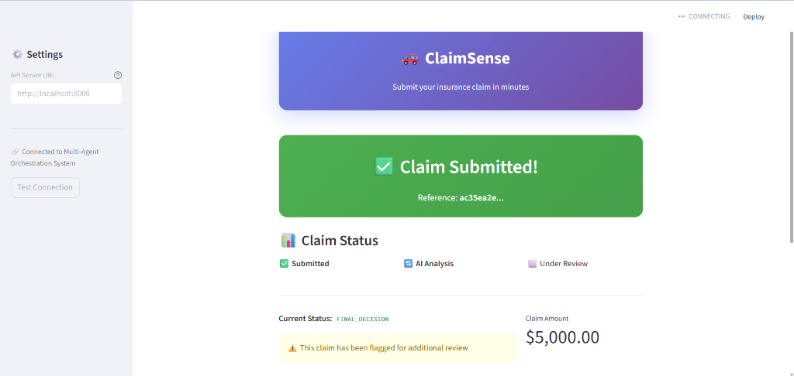
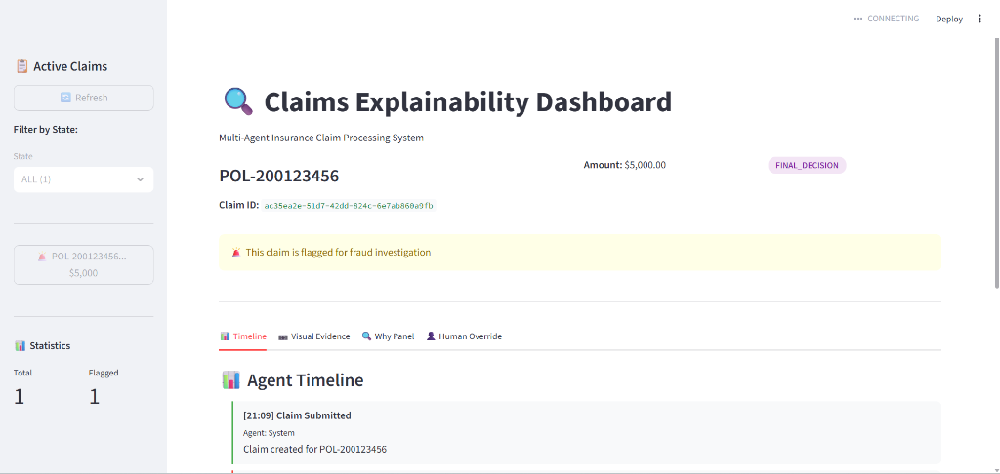
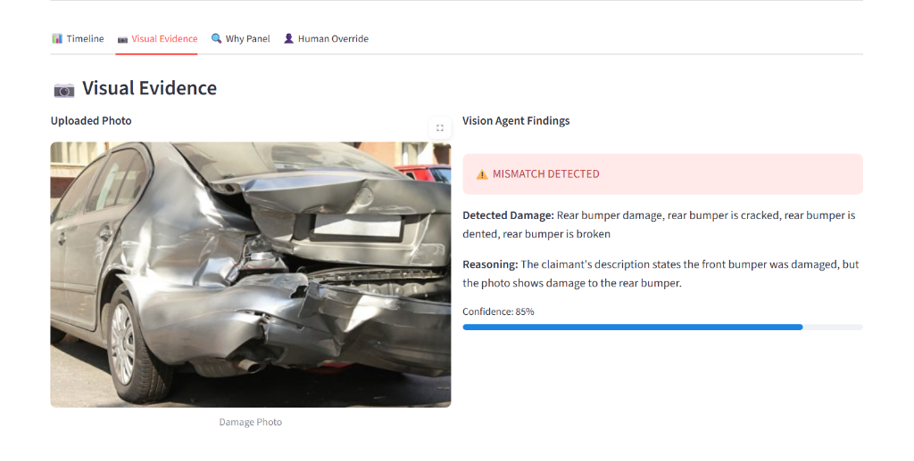
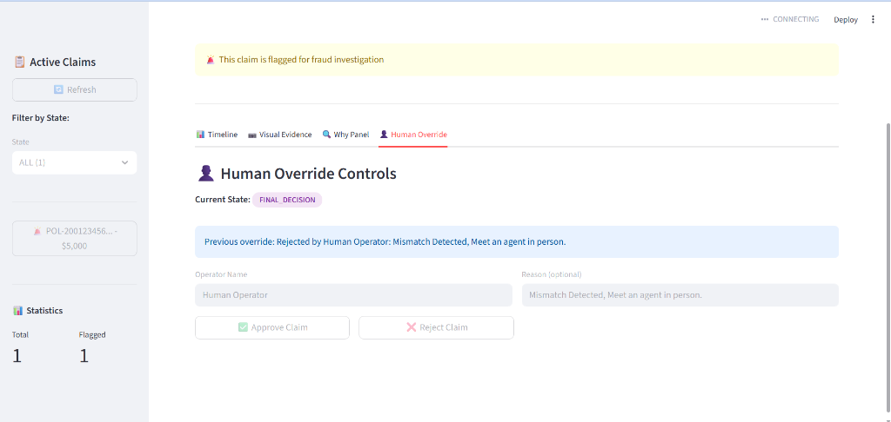

# 🔍 Multi-Agent Insurance Claim Orchestration System

An AI-powered insurance claim processing system that uses **multiple local LLM agents** (Ollama) to detect fraud through vision and text analysis.

## 📸 Screenshots

<table>
<tr>
<td width="50%">

<p align="center"><strong>Claimant Portal</strong><br/>Customer-facing claim submission</p>
</td>
<td width="50%">

<p align="center"><strong>Admin Dashboard</strong><br/>Agent timeline & claim details</p>
</td>
</tr>
<tr>
<td width="50%">

<p align="center"><strong>Vision Agent Analysis</strong><br/>AI-powered damage detection & mismatch flagging</p>
</td>
<td width="50%">

<p align="center"><strong>Human Override Controls</strong><br/>Approve or reject with audit logging</p>
</td>
</tr>
</table>

## ✨ Features

- **🤖 Multi-Agent Architecture** - Vision and Text agents work together via an orchestrator
- **👁️ Vision Agent** - Uses Llama 3.2-Vision to compare damage photos with claim descriptions
- **📝 Text Agent** - Uses Llama 3 as a "Forensic Linguist" to detect inconsistencies between call logs and written claims
- **🔄 Dynamic State Machine** - Automatically routes suspicious claims to fraud investigation
- **📊 Explainability Dashboard** - Streamlit UI showing agent reasoning and decision timeline
- **👤 Human Override** - Operators can approve/reject claims with full audit logging
- **📱 Claimant Portal** - Mobile-friendly web portal for customers to submit claims

## 🏗️ Architecture

```
┌─────────────────┐                    ┌─────────────────┐
│  Claimant Portal│                    │    Dashboard    │
│  (client_app.py)│                    │  (dashboard.py) │
│   Customer UI   │                    │    Admin UI     │
└────────┬────────┘                    └────────┬────────┘
         │                                      │
         └──────────────┬───────────────────────┘
                        │
         ┌──────────────▼──────────────────────────────────┐
         │                   FastAPI                        │
         │  ┌─────────────┐  ┌─────────────┐  ┌──────────┐ │
         │  │ Vision Agent│  │ Text Agent  │  │Orchestrator│
         │  │ (Llama 3.2- │  │ (Llama 3)   │  │           │ │
         │  │   Vision)   │  │             │  │           │ │
         │  └──────┬──────┘  └──────┬──────┘  └─────┬─────┘ │
         │         └────────────────┴───────────────┘       │
         │                          │                       │
         │              ┌───────────▼───────────┐           │
         │              │    State Machine      │           │
         │              │  (Dynamic Routing)    │           │
         │              └───────────────────────┘           │
         └──────────────────────────────────────────────────┘
```

## 🚀 Quick Start

### Prerequisites

- Python 3.10+
- [Ollama](https://ollama.ai) installed locally

### 1. Clone & Install

```bash
git clone <your-repo-url>
cd claim-automation
pip install -r requirements.txt
```

### 2. Pull Ollama Models

```bash
ollama pull llama3.2-vision
ollama pull llama3
```

### 3. Run the System

**Terminal 1 - API Server:**

```bash
uvicorn app.main:app --reload --port 8000
```

**Terminal 2 - Claimant Portal (Customer UI):**

```bash
streamlit run client_app.py
```

**Terminal 3 - Admin Dashboard:**

```bash
streamlit run dashboard.py --server.port 8502
```

### 4. Access

| Service         | URL                        | Description               |
| --------------- | -------------------------- | ------------------------- |
| API Docs        | http://localhost:8000/docs | FastAPI Swagger UI        |
| Claimant Portal | http://localhost:8501      | Customer claim submission |
| Admin Dashboard | http://localhost:8502      | Staff claim management    |

### 5. Test Full Cycle

```bash
python test_full_cycle.py
```

## 📡 API Endpoints

| Method | Endpoint                     | Description                      |
| ------ | ---------------------------- | -------------------------------- |
| POST   | `/claims/`                   | Create new claim                 |
| GET    | `/claims/{id}`               | Get claim details                |
| POST   | `/claims/{id}/advance`       | Advance claim state              |
| POST   | `/claims/{id}/upload-photo`  | Upload photo for vision analysis |
| POST   | `/claims/{id}/analyze-text`  | Analyze text consistency         |
| POST   | `/claims/{id}/full-analysis` | Run both agents                  |
| POST   | `/claims/{id}/approve`       | Human override - approve         |
| POST   | `/claims/{id}/reject`        | Human override - reject          |

## 🔄 Claim States

```
SUBMITTED → UNDER_REVIEW → ASSESSMENT → FINAL_DECISION
                 ↓
        FRAUD_INVESTIGATION (dynamic insertion)
```

## 🕵️ Fraud Detection

### Vision Agent

Compares uploaded damage photos against claim descriptions:

- Claim says "front damage" + Photo shows rear damage = **MISMATCH**

### Text Agent

Compares call logs with written claims looking for:

- **Fact Mismatches** (weather, time, location)
- **Story Shifts** (changing who was at fault)
- **Urgency Indicators** (pressure to process quickly)

Returns an `inconsistency_score` (0-10). Score ≥ 5 = **SUSPICIOUS**

## 📁 Project Structure

```
claim-automation/
├── app/
│   ├── main.py              # FastAPI entry point
│   ├── core/
│   │   ├── states.py        # ClaimState enum
│   │   └── models.py        # Pydantic models
│   ├── state_machine/
│   │   └── machine.py       # State transitions
│   ├── agents/
│   │   ├── vision_agent.py  # Llama 3.2-Vision
│   │   ├── text_agent.py    # Llama 3 Forensic Linguist
│   │   └── orchestrator.py  # Multi-agent coordination
│   ├── monitors/
│   │   └── process_monitor.py
│   └── api/
│       └── endpoints.py
├── client_app.py            # Streamlit Claimant Portal
├── dashboard.py             # Streamlit Admin Dashboard
├── test_full_cycle.py       # End-to-end test script
├── requirements.txt
└── README.md
```

## 🛠️ Tech Stack

- **Backend:** FastAPI, Pydantic
- **AI/ML:** Ollama (Llama 3.2-Vision, Llama 3)
- **Frontend:** Streamlit
- **State Management:** Custom state machine with dynamic routing

## 📝 License

MIT License

## 🤝 Contributing

Contributions welcome! Please open an issue or PR.
